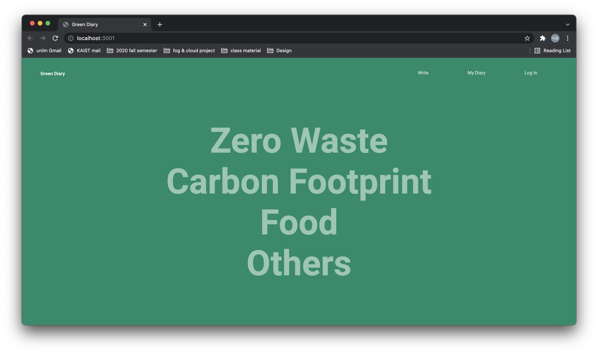
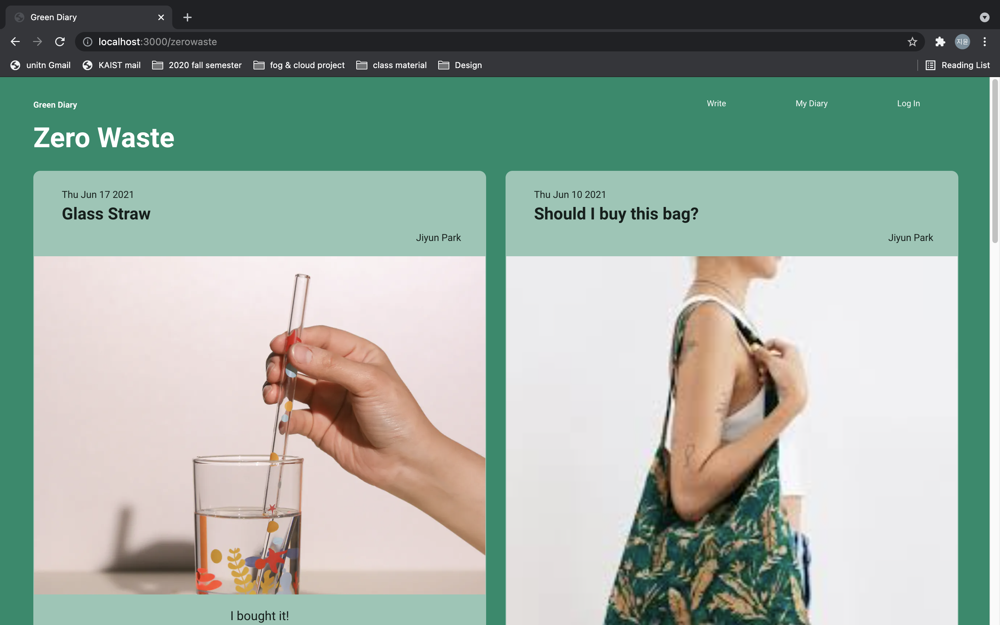
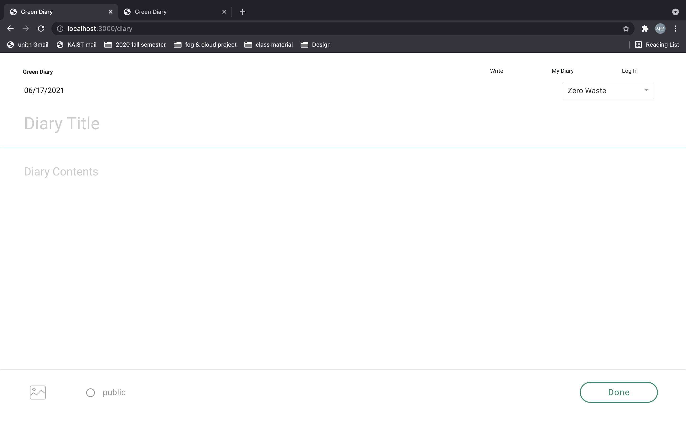
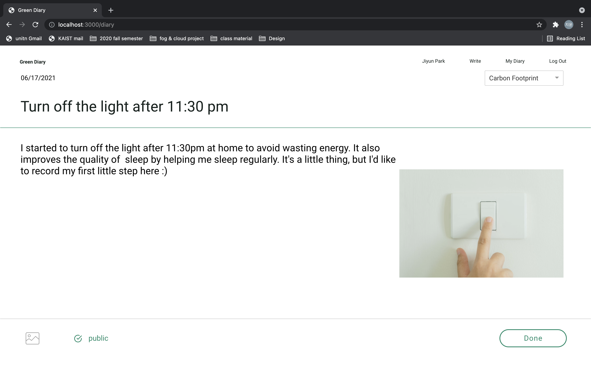
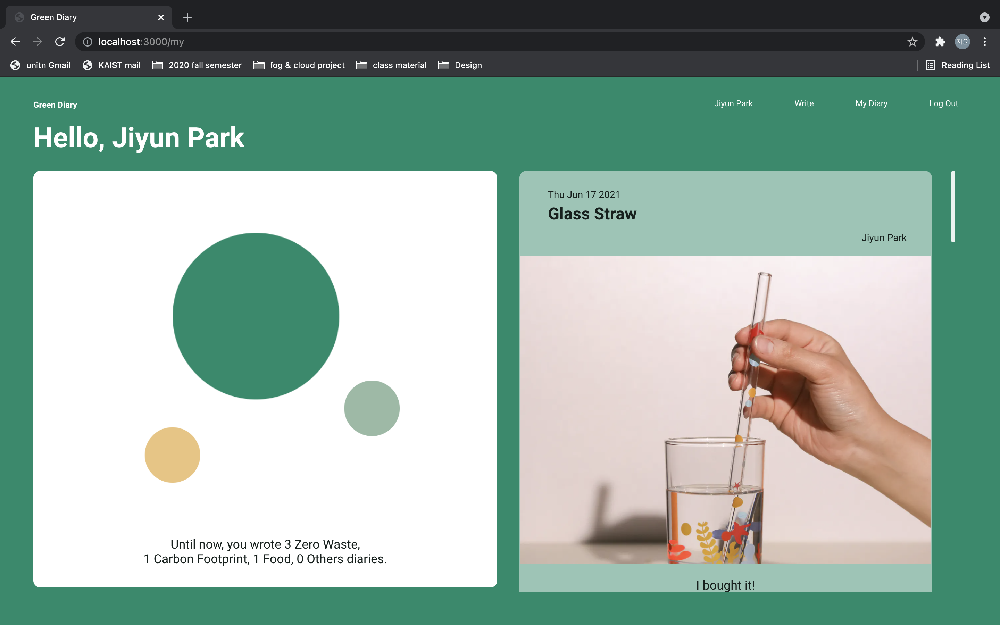
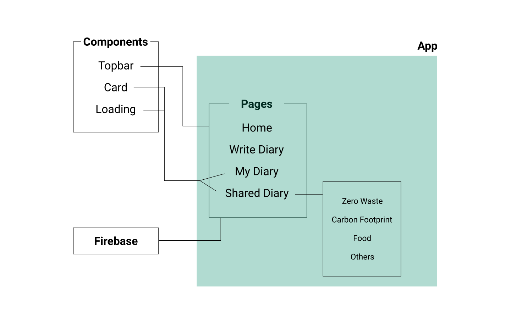
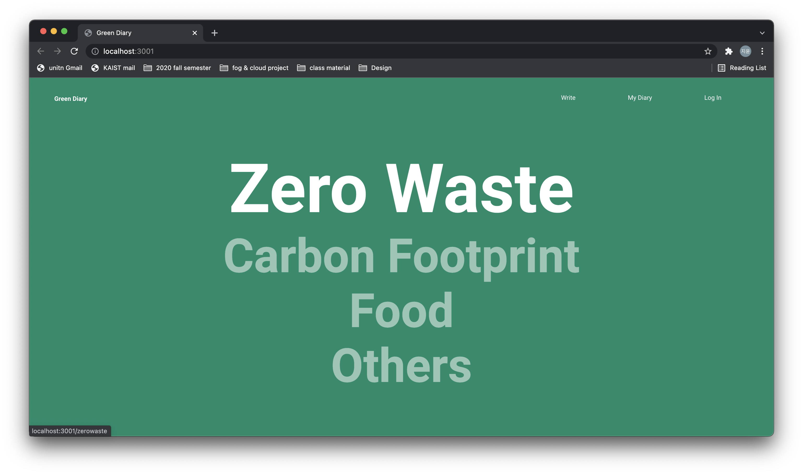

# Project

## Basic info

- **name**: Jiyun Park (박지윤)
- **email**: wldbs0507@kaist.ac.kr

## Index of content

1. [Brief overview](#brief-overview)
2. [Detailed description](#detailed-description)
3. [Resources](#resources)
4. [Credits](#credits)
5. [License](#license)

## Brief overview

A Diary app that allows users to keep an environmental diary, both personally and publicly.

### How to run project
### Install
```
$ git clone http://git.prototyping.id/20160272/Project.git
$ cd GreenDiary
$ npm install 
```
Clone the project and install all packages required for this project
### Start & Debug
```
$ npm start
```
Runs the app in the development mode.\
Open [http://localhost:3000](http://localhost:3000) to view it in the browser.

### Build
```
$ npm run build
```
Builds the app for production to the `build` folder.

### Deployment
```
$ firebase deploy
```
Deploys the lastest version of app.   
Open Hosting URL: [https://greendiary-2ac70.web.app](https://greendiary-2ac70.web.app) 

---
## Detailed description
### How to Use
There are 4 pages : ```Main``` , ```Write Diary``` , ```Shared Diary``` , ```My Diary```    

1. ```Main``` 


 
 In Main page, you can browse the 4 category (Zero Waste, Carbon Footprint, Food, and others).

2. ```Shared Diary```


 
 When you click specific category, you can find someone else's public diaries.
3. ```Write Diary``` 



Before writing diary, don't forget to log in to save your data. Click the 'Write' in topbar to move to write diary page. 



Fill title and contents, select the date, category, and image. If you want you share your diary with other users, don't forget to make it public.

4. ```My Diary``` 



After writing, you can check your diary also in your private area, 'My Diary' page. You can see the ratio of the categories you wrote.

## Structure

Components are for the highly reused code, such as Topbar, Card, and Loading page. As I mentioned eariler, there are 4 pages with 4 categories and I used firestore to store post and user data.

## Details


Notable feature of this app is hovering animation in ```Main```.
```js
<div className="zerowaste">
    <Link to="/zerowaste" style={{ color: 'inherit', textDecoration: 'inherit' }}>
        <span>Zero Waste</span>
    </Link>
</div>
```
- Part of Home.js   

```css
.zerowaste{
    font-size: 90px;
    font-weight: bold;
    color: rgba(255, 255, 255, 0.5);
    cursor: pointer;
}

.zerowaste:hover span{
    color: rgba(255, 255, 255, 1);
    font-size: 130px;
}
```
- Part of home.css  

To emphasize, Add css font-size change to the category text when the category text part is hovered. 


```js
<nav className="topbarContainer">
    <div className="topbarLeft"> // Logo </div>
    <div className="topbarCenter"></div>
    <div className="topbarRight">
        <div className="topbarUser">{user.displayName}</div>
        <Link className="topbarText" to="/diary">Write</Link>
        <Link className="topbarText" to="/my">My Diary</Link>
        <div className="loginout"> // Log Out Button</div>
    </div>

</nav>
```
- Part of Topbar.js   
```css
.topbarContainer{
    height: 25%;
    width: 100%;
    display: flex;
    align-items: center;
}

.topbarLeft{
    flex: 2;
}

.topbarRight{
    flex: 4;
    display: flex;
    align-items: left;
    justify-content: space-between;
    align-items: center;
}
```
- Part of topbar.css 

I use `flex` properties to well-padding and dynamically resize in Topbar. Divide 3 part, and then set the flex value.


## Resources

1. [Demo Video](https://youtu.be/-jb4wYbWJx0)
2. Server: I used firestore and it doesn't have public link.

## Credits

- [Youtube - animation](https://www.youtube.com/watch?v=I_RhD99rR0c&list=PL1jXTNi03AlpEJZOL_nx7j2qosCud_-Dn&index=5)   
- [Firebase](https://firebase.google.com/docs/firestore)
- `Javascripts`, `Firebase` deploy taught by Professor 

## License

 MIT License   

Copyright (c) 2021 Jiyun Park
     
Permission is hereby granted, free of charge, to any person obtaining a copy
of this software and associated documentation files (the "Software"), to deal
in the Software without restriction, including without limitation the rights
to use, copy, modify, merge, publish, distribute, sublicense, and/or sell
copies of the Software, and to permit persons to whom the Software is
furnished to do so, subject to the following conditions:
     
The above copyright notice and this permission notice shall be included in all
copies or substantial portions of the Software.
     
THE SOFTWARE IS PROVIDED "AS IS", WITHOUT WARRANTY OF ANY KIND, EXPRESS OR
IMPLIED, INCLUDING BUT NOT LIMITED TO THE WARRANTIES OF MERCHANTABILITY,
FITNESS FOR A PARTICULAR PURPOSE AND NONINFRINGEMENT. IN NO EVENT SHALL THE
AUTHORS OR COPYRIGHT HOLDERS BE LIABLE FOR ANY CLAIM, DAMAGES OR OTHER
LIABILITY, WHETHER IN AN ACTION OF CONTRACT, TORT OR OTHERWISE, ARISING FROM,
OUT OF OR IN CONNECTION WITH THE SOFTWARE OR THE USE OR OTHER DEALINGS IN THE
SOFTWARE.
